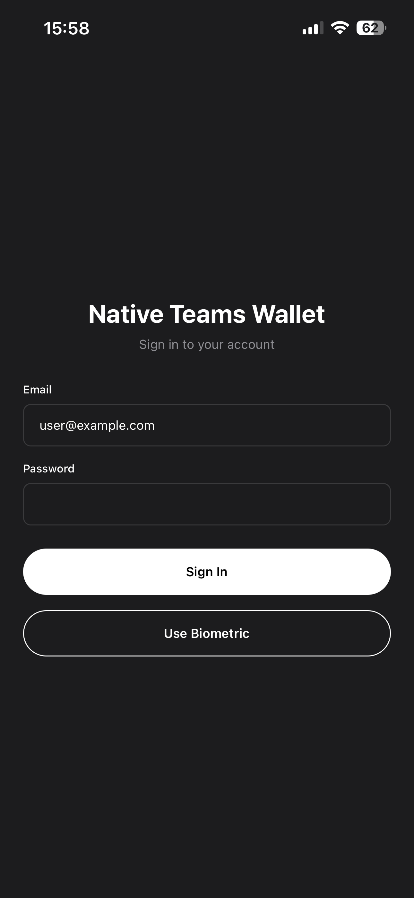
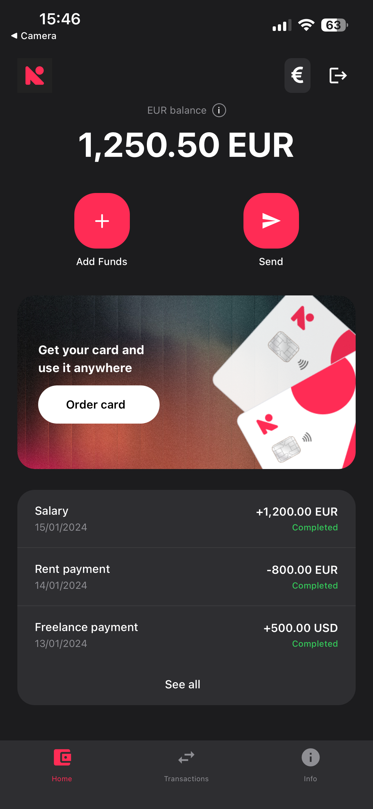
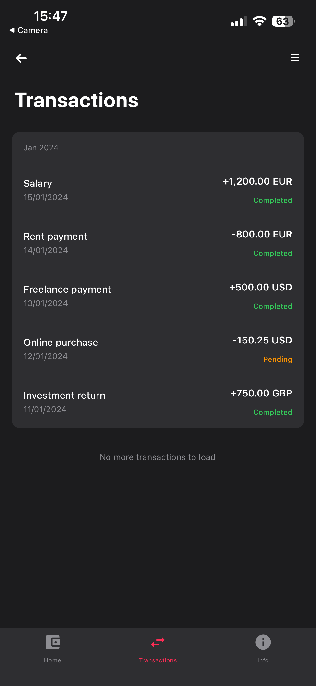
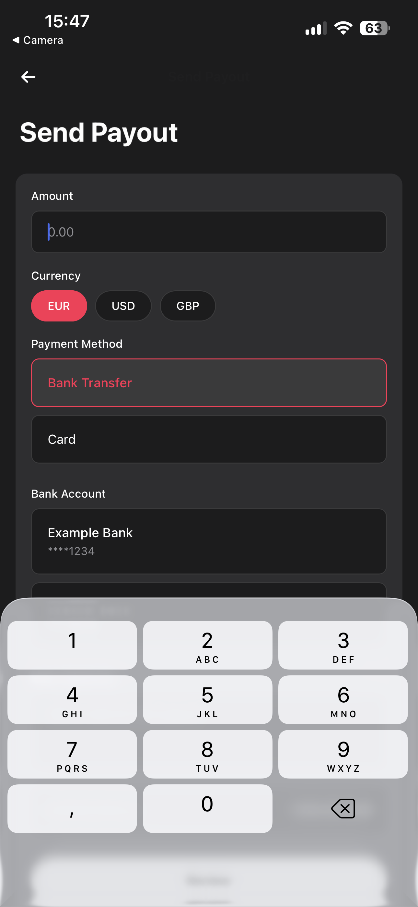
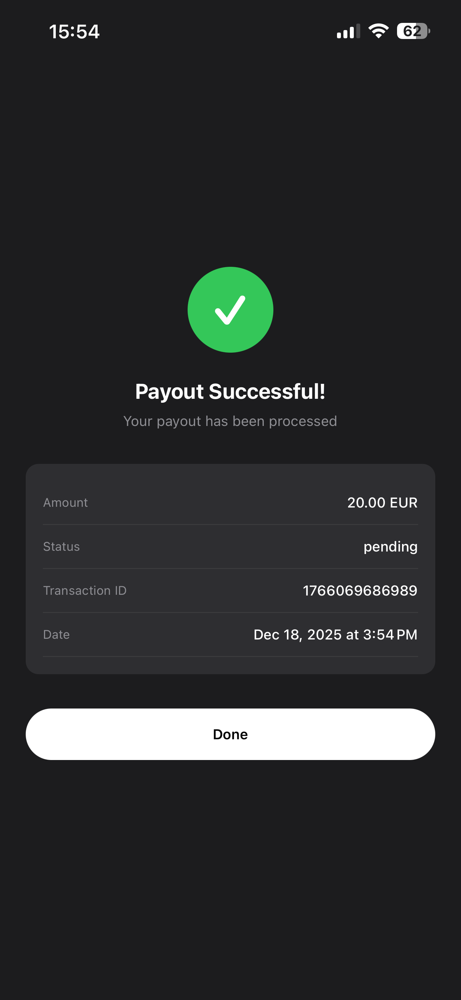

# Native Teams Wallet App

A React Native mobile wallet application built with Expo and TypeScript.

## Features

- Wallet balance management and transaction history
- Send payouts with multi-step flow
- Transaction filtering and pagination
- Offline data caching
- Biometric authentication
- Deep linking support

## Tech Stack

- **React Native** with **Expo** (~54.0.0)
- **TypeScript**
- **React Navigation** (Stack + Bottom Tabs)
- **Redux Toolkit** for state management
- **TanStack Query** for data fetching
- **Axios** for API calls

## Installation

1. Clone and install dependencies:

```bash
npm install
```

2. Configure environment variables in `.env`:

```
EXPO_PUBLIC_API_BASE_URL=http://localhost:3000
EXPO_PUBLIC_API_BASE_URL_DEVICE=http://192.168.x.x:3000
```

3. Start the development server:

```bash
npx expo start
```

### Mock Server

```bash
cd mock-server-main
npm install
npm start
```

Run tests:

```bash
npm test
```

## Screenshots

<div align="center">
  
  
  
</div>

<div align="center">
  
  
</div>
